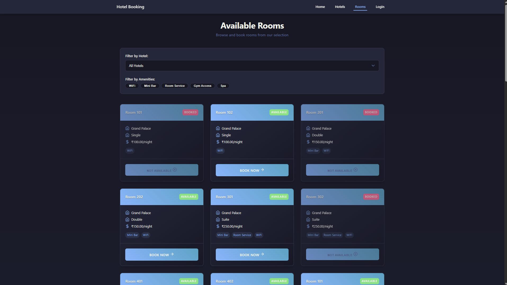
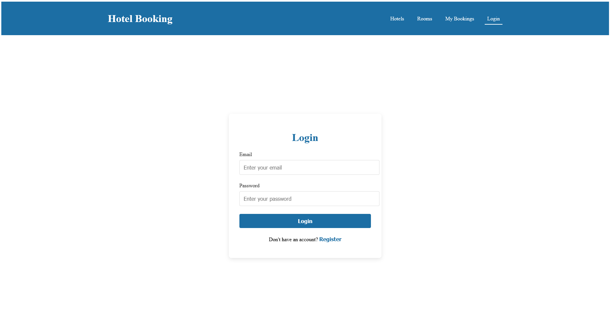

# hotel-booking
(collage project) a hotel booking website built with svelte and mysql

## Technologies Used
- Frontend: Svelte
- Backend: Node.js, Express.js
- Database: MySQL

## Getting Started

1. Clone the repository:
   ```bash
   git clone https://github.com/jr4dh3y/hotel-booking/
   ```
2. Navigate to the project directory:
   ```bash
    cd hotel-booking
    ```
3. Install the dependencies for both the frontend and backend:
   ```bash
   cd frontend
   npm install
   cd ../backend
   npm install
   ```
4. Set up the database:
    - Create a MySQL database and import the `db.sql` file located in the `backend/mysql-query` directory.
    - Update the database connection details in the `db.js` file in the `backend` directory.

5. Start the backend server:
    ```bash
    cd backend
    npm start
    ```
6. Start the frontend development server:
    ```bash
    cd frontend
    npm run dev
    ```
7. Open your browser and navigate to `http://localhost:5173` to view the application.

- Note: 
    1. The backend server will be running on `http://localhost:3000` by default.
    2. You can change the port in the `backend/server.js` file if needed.
    3. Make sure to have MySQL server running and the database created before starting the backend server.

## Screenshots
<div style="display: grid; grid-template-columns: repeat(2, 1fr); gap: 20px;">
    
    
    
    
</div>
